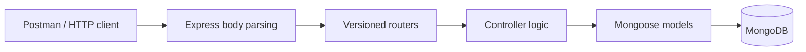

<div align="center">

# Backend Foundations

### User workflows, database modelling, and CRUD APIs with Node.js


**7 HTTP endpoints · 2 Mongoose models · Modular backend architecture**

A hands-on backend learning project by **Gourav Dutta**.

[Overview](#overview) · [Architecture](#architecture) · [Setup](#local-setup) · [API Reference](#api-reference) · [Postman](#postman-workflow) · [Roadmap](#current-limitations-and-roadmap)

</div>

---

## Overview

`intro_to_backend` explores how a JavaScript backend receives requests, applies application logic, communicates with a database, and returns responses. The implementation covers user registration, password checking, a logout acknowledgement, and create/read/update/delete operations for a sample `Post` resource.

The project separates **routes, controllers, models, application configuration, and server startup** rather than placing everything in one file. Postman provides the client-side workflow for composing API requests and inspecting responses without a frontend.

> **Project stage:** learning and development. The repository contains user account handlers and CRUD functionality, but it does not yet implement token/session authentication or access control. It should not be treated as a production-ready authentication service.

This document reflects the application code at commit [`df3ada1`](https://github.com/yupitsmegd7/intro_to_backend/commit/df3ada113481641d694d43e89039fe0b49f34755), reviewed on **3 October 2026**. Response examples describe the implementation; they are not a report of live integration tests.

## What has been implemented

| Area | Implementation |
| --- | --- |
| Project foundation | Node.js project using ES modules, dependency management, a lockfile, and separate development/start commands. |
| Express application | JSON and URL-encoded body parsing, with user and post routers mounted under `/api/v1`. |
| Database connection | Environment-driven Mongoose connection, a missing-URI check, connection logging, and startup that waits for MongoDB. |
| User registration | Required-field checks, email lowercasing, an existing-email lookup, user creation, and a response that excludes the password. |
| Password handling | An asynchronous Mongoose save hook hashes modified passwords using bcrypt with a cost factor of `10`. A model method supports password comparison. |
| Login | Email lookup, password comparison, and a response containing the user's ID, email, and username. No token or session is issued. |
| Logout handler | Checks the supplied email and whether the user exists, then returns a confirmation. It does not invalidate a session. |
| Post management | Create a post, fetch all posts, update a post by ID, and delete a post by ID. |
| Models and responses | Schema constraints, automatic timestamps, basic controller validation, and HTTP responses for success and several failure cases. |

Implementation: [application](backend/src/app.js), [user controller](backend/controllers/user.controller.js), [post controller](backend/controllers/post.controller.js), and [models](backend/models).

## Technology stack

The versions below are the **dependency ranges declared in `package.json`**, not claims about the latest available versions.

| Technology | Declared range | Role |
| --- | --- | --- |
| Node.js | Not pinned in this repository | JavaScript runtime; ES-module imports and exports. |
| Express | `^5.2.1` | HTTP server framework, middleware, and routing. |
| Mongoose | `^9.10.2` | MongoDB models, schemas, validation, and queries. |
| bcrypt | `^6.0.0` | Password hashing and comparison. |
| dotenv | `^18.0.4` | Loads configuration from the root `.env` file. |
| nodemon | `^1.14.10` | Development server restart tooling. |
| Postman | External tool | Manual API request construction and response inspection. |

Dependency declarations and commands: [`package.json`](package.json). Dependency resolution: [`package-lock.json`](package-lock.json).

## Architecture



Controllers use the database results to return an HTTP status and JSON response to the client. The layers have distinct responsibilities:

| Layer | Responsibility |
| --- | --- |
| `routes/` | Match an HTTP method and path to the appropriate controller. |
| `controllers/` | Read request data, perform checks, call models, and build responses. |
| `models/` | Define document fields, constraints, timestamps, and password-related model logic. |
| `src/config/` | Hold database connection configuration and shared constants. |
| `src/app.js` | Configure Express middleware and mount routers. |
| `src/index.js` | Load environment values, connect to MongoDB, and start listening. |

### Repository structure

```text
intro_to_backend/
├── backend/
│   ├── controllers/
│   │   ├── post.controller.js
│   │   └── user.controller.js
│   ├── models/
│   │   ├── post.model.js
│   │   └── user.model.js
│   ├── routes/
│   │   ├── post.route.js
│   │   └── user.route.js
│   └── src/
│       ├── config/
│       │   ├── constants.js
│       │   └── database.js
│       ├── app.js
│       └── index.js
├── .gitignore
├── package-lock.json
├── package.json
└── README.md
```

Create `.env` locally in the repository root; it is excluded by `.gitignore`. A `.env.example` is not currently tracked.

### Startup sequence

```text
Load .env → Check MONGODB_URI → Connect to MongoDB → Start Express
```

The server listens on `process.env.PORT`, falling back to **8000**. Because database connection happens first, a failed MongoDB connection prevents the HTTP server from starting. See [startup](backend/src/index.js) and [connection handling](backend/src/config/database.js).

## Data models

### User

| Field | Current schema rules |
| --- | --- |
| `username` | Required string; trimmed and lowercased; 2–30 characters; unique index declared. |
| `email` | Required string; trimmed and lowercased; 11–30 characters; unique index declared. |
| `password` | Required string; 6–30 characters before hashing on creation. |
| `createdAt`, `updatedAt` | Managed through Mongoose timestamps. |

The save hook checks `isModified("password")` before hashing. Registration and login explicitly return only `id`, `email`, and `username`, not the stored password.

The email length constraint is **not** an email-format validator. Also, Mongoose's `unique` setting declares an index rather than a normal validation rule. The password comparison method has a direct string-equality shortcut that should be removed; see the roadmap.

Source: [`user.model.js`](backend/models/user.model.js). Reference: [Mongoose validation](https://mongoosejs.com/docs/validation.html).

### Post

| Field | Current schema rules |
| --- | --- |
| `name` | Required, trimmed string. |
| `description` | Required, trimmed string. |
| `age` | Required number, with schema minimum `1` and maximum `60`. |
| `createdAt`, `updatedAt` | Managed through Mongoose timestamps. |

`Post` is a simple practice resource with these three business fields. It does not currently reference a user or implement authorship/ownership. Creation uses schema validation; the update handler does not yet enable update validators.

Source: [`post.model.js`](backend/models/post.model.js) and [`post.controller.js`](backend/controllers/post.controller.js).

## Local setup

### 1. Prerequisites

Use Node.js meeting [Mongoose 9's minimum requirement of **20.19.0**](https://mongoosejs.com/docs/migrating_to_9.html#node-js-version-support); prefer an actively supported Node.js release. You also need npm, Git, a reachable MongoDB database, and Postman for the walkthrough.

For MongoDB Atlas, configure a database user and allow your current public IP in the project's IP access list. Use a development database for testing.

### 2. Clone and install

```bash
git clone https://github.com/yupitsmegd7/intro_to_backend.git
cd intro_to_backend
npm ci
```

Run commands from the **repository root**, where `package.json` lives.

### 3. Configure the environment

Create a root `.env` file:

```dotenv
PORT=4000
MONGODB_URI="mongodb+srv://<DATABASE_USER>:<URL_ENCODED_PASSWORD>@<CLUSTER_HOST>/intro_to_backend?retryWrites=true&w=majority"
```

Replace the placeholders using the connection string from Atlas. The database user's credentials are different from an Atlas website login. URL-encode reserved characters in credentials, and never commit the completed URI or a real password.

`PORT=4000` makes the examples in this README match the server. Without that variable, use port `8000` instead.

Although [`constants.js`](backend/src/config/constants.js) exports `DB_NAME = "intro_to_backend"`, the connection helper does not currently import it. Specify the intended database in `MONGODB_URI`; the unused constant does not select it automatically.

### 4. Start the application

```bash
npm run dev
```

Or run without the development watcher:

```bash
npm start
```

Both scripts target `backend/src/index.js`. Wait for the database-connected and server-listening messages before sending requests. A successful start has not been verified against your Atlas environment by this documentation review.

## API reference

With the sample environment, the server origin is `http://localhost:4000`.

| Method | Endpoint | Request data | Success response |
| --- | --- | --- | --- |
| `POST` | `/api/v1/users/register` | JSON: `username`, `email`, `password` | `201` — message and user profile. |
| `POST` | `/api/v1/users/login` | JSON: `email`, `password` | `200` — message and user profile. |
| `POST` | `/api/v1/users/logout` | JSON: `email` | `200` — logout acknowledgement. |
| `POST` | `/api/v1/posts/create` | JSON: `name`, `description`, `age` | `201` — message and created post. |
| `GET` | `/api/v1/posts/get` | No body required. | `200` — array of posts. |
| `PATCH` | `/api/v1/posts/update/:id` | Post ID in the path; JSON fields to update. | `200` — message and updated post. |
| `DELETE` | `/api/v1/posts/delete/:id` | Post ID in the path; no body required. | `200` — deletion confirmation. |

These are the routes currently implemented, including their action-based path names. The read endpoint fetches all posts; there is no separate get-one-post endpoint. The list response is a plain array, while most other responses are objects containing a message.

**Authorization:** no bearer token, cookie session, or protected-route middleware is implemented. User and post routes are currently unprotected.

Route definitions: [user routes](backend/routes/user.route.js), [post routes](backend/routes/post.route.js), and [router prefixes](backend/src/app.js).

## Postman workflow

### How Postman fits this project

Postman is the API client in this learning workflow: it lets the developer choose HTTP methods, enter endpoint URLs, submit JSON payloads, and inspect response bodies and status codes. This makes it possible to exercise the backend independently of a user interface and distinguish HTTP errors from a server that never started.

**Testing evidence:** no exported Postman collection, saved run report, or automated test suite is tracked in the reviewed repository. The steps below are a reproducible manual test guide based on the source code, not evidence that every request has already passed.

### Request setup

Create a collection named **Backend Foundations**. Add these collection variables:

| Variable | Initial value | Purpose |
| --- | --- | --- |
| `baseUrl` | `http://localhost:4000` | Server origin; change it to match `PORT`. |
| `postId` | Leave empty initially. | ID of the disposable post created during the walkthrough. |

For requests with a JSON body, use **Body → raw → JSON**. Postman sets the appropriate content type when JSON is selected; check that it is `application/json`. Select **No Auth** for these currently unprotected routes.

For example:

```text
Method: POST
URL:    {{baseUrl}}/api/v1/users/register
Body:   raw → JSON
```

The complete URL belongs in the URL bar. In `http://localhost:4000/api/v1/users/register`, `http` is the protocol, `localhost` is the host, `4000` is the port, and `/api/v1/users/register` is the path. Do not place path segments into the **Params** tab. Likewise, `:id` in update/delete routes is a path parameter, not a query parameter.

References: [request bodies](https://learning.postman.com/docs/use/send-requests/create-requests/parameters/) and [variables](https://learning.postman.com/docs/sending-requests/variables/).

### A. Register a user

**POST** `{{baseUrl}}/api/v1/users/register`

```json
{
  "username": "backend_learner",
  "email": "learner@example.com",
  "password": "DemoOnly!2026"
}
```

Use disposable credentials. The controller expects these three fields; `fullName` is not part of the current model or registration handler.

Expected success shape, with an illustrative ID placeholder:

```json
{
  "message": "Registered successfully",
  "user": {
    "id": "<USER_ID>",
    "email": "learner@example.com",
    "username": "backend_learner"
  }
}
```

Expected status: **201**. Repeating registration with the same normalized email reaches the existing-user check and returns **400**. To test a fresh registration again, choose a new username and email.

### B. Check login

**POST** `{{baseUrl}}/api/v1/users/login`

```json
{
  "email": "learner@example.com",
  "password": "DemoOnly!2026"
}
```

Expected success: **200**, with the user's ID, email, and username. This verifies the credentials through the handler; it does not create a persistent authenticated session or return an access token.

### C. Create a disposable post

**POST** `{{baseUrl}}/api/v1/posts/create`

```json
{
  "name": "Backend learning log",
  "description": "Practising Express routes and MongoDB CRUD operations.",
  "age": 19
}
```

Expected success: **201**, with `message` and `post`. Copy `post._id` from the response into the collection variable `postId`.

Alternatively, add this example under **Scripts → Post-response** for the create request:

```javascript
pm.test("Post creation returns 201", function () {
    pm.response.to.have.status(201);
});

if (pm.response.code === 201) {
    const data = pm.response.json();

    pm.test("Response includes a post ID", function () {
        pm.expect(data.post).to.be.an("object");
        pm.expect(data.post._id).to.be.a("string");
    });

    if (data.post && typeof data.post._id === "string") {
        pm.collectionVariables.set("postId", data.post._id);
    }
}
```

This is a suggested test snippet, not a previously executed test. See [Postman's script examples](https://learning.postman.com/docs/tests-and-scripts/write-scripts/test-examples/). Continue only after successful creation and verification of the saved ID.

### D. Retrieve posts

**GET** `{{baseUrl}}/api/v1/posts/get`

No request body is needed. Expected success: **200**, returning an array. Find the record with the saved `postId`.

### E. Update the same post

**PATCH** `{{baseUrl}}/api/v1/posts/update/{{postId}}`

```json
{
  "description": "Updated after practising PATCH requests in Postman.",
  "age": 20
}
```

Expected success: **200**, with the updated post. The controller uses `findByIdAndUpdate()` with `{ new: true }` to return the updated document. It does not yet enable `runValidators` or explicitly allowlist update fields.

### F. Delete the disposable post

**DELETE** `{{baseUrl}}/api/v1/posts/delete/{{postId}}`

No body is required. Delete only the record created for this walkthrough. Expected success: **200**, with `"Successfully deleted the Post"`. Fetch the list again to check that the record is absent. A second deletion of the same valid ID should reach the **404** branch.

### G. Exercise the logout handler

**POST** `{{baseUrl}}/api/v1/users/logout`

```json
{
  "email": "learner@example.com"
}
```

Expected success: **200**, with `"Log out successful"`. This checks the email and confirms the user exists; it does **not** revoke credentials, clear cookies, invalidate a token, or delete the user.

The walkthrough leaves a test user in the database. No user-deletion endpoint is currently implemented.

### Negative cases to inspect

These outcomes follow the current controller branches; they are not recommended status-code conventions for every future version.

| Test condition | Current expected handling |
| --- | --- |
| Registration missing a required field | `400` — `All Fields are important`. |
| Registration with an existing normalized email | `400` — `User already exists`. |
| Login with an unknown email | `400` — `User Not Found`. |
| Login with a wrong password for an existing user | `400` — `Invalid Credentials`. |
| Logout without an email / with an unknown email | `400` / `404`, respectively. |
| Create post with a missing required field | `400` — `Required fields are mandatory`. |
| Update with an explicitly supplied empty JSON object `{}` | `400` — `Cannot pass empty fields`. |
| Update/delete with a valid ObjectId that has no matching document | `404`. |
| Malformed ObjectId, schema validation failure, or duplicate-key exception | Generally falls into a `500` catch response rather than a dedicated client-error handler. |

Inspect both the HTTP response and server logs. An error status is useful evidence about a particular branch, but it does not establish that the entire API is correct or secure.

## Troubleshooting

| Symptom | What to check |
| --- | --- |
| `MONGODB_URI is missing from environment variables` | Create `.env` beside `package.json`, use the exact variable name, and launch from the repository root. |
| `MongooseServerSelectionError` or `ReplicaSetNoPrimary` | Check Atlas availability, the current public IP access entry, database credentials, and network/firewall connectivity. The IP warning is a suggestion, not proof of the cause. |
| Postman cannot connect to port `4000` | Confirm MongoDB connected and Express started; set `PORT=4000` or use the actual listening port, which defaults to `8000`. |
| A route returns 404 | Match both the method and the complete path in the API table. A browser address-bar request uses GET and is not a substitute for POST registration. |
| Request data is missing or rejected | Use raw JSON with `Content-Type: application/json`, valid JSON syntax, and the exact model/controller field names. |
| Update/delete fails on an ID | Use the actual `post._id` from the create response, not a username, placeholder, or user ID. |
| Postman web cannot reach the local server | Use the desktop application or the web application with the Desktop Agent, rather than the Cloud Agent. |

For Atlas, keep IP access limited to addresses you need and re-check it after changing networks. Do not publish a real connection string while seeking help.

References: [Atlas connection troubleshooting](https://www.mongodb.com/docs/atlas/troubleshoot-connection/) and [Postman Agent](https://learning.postman.com/docs/getting-started/basics/about-postman-agent/).

## Learning outcomes

This codebase provides practice in organising ES-module projects; distinguishing server startup from application configuration; mapping methods and paths to controllers; reading `req.body` and `req.params`; working with asynchronous database operations; defining Mongoose schemas; using save hooks and model methods; handling password hashes; and connecting CRUD operations to HTTP responses.

The Postman workflow develops a related skill: constructing a request deliberately and interpreting its result, rather than treating an API as a black box. It also highlights the difference between a credentials check, an authenticated session, and permission to change a resource.

## Development milestones

The repository history records these milestones:

| Date | Commit | Recorded change |
| --- | --- | --- |
| 28 September 2026 | [`c100dd8`](https://github.com/yupitsmegd7/intro_to_backend/commit/c100dd8bb41f9e5e293fb711cca1528ac76b42fe) | Initial commit. |
| 3 October 2026 | [`a9ea0f6`](https://github.com/yupitsmegd7/intro_to_backend/commit/a9ea0f6fca26bffe6f399464e820520b763133d2) | Added user-account API work (`Added AUTH APIs`). |
| 3 October 2026 | [`df3ada1`](https://github.com/yupitsmegd7/intro_to_backend/commit/df3ada113481641d694d43e89039fe0b49f34755) | Added post CRUD functionality (`added CRUD features`). |

## Current limitations and roadmap

The following items are **not completed features**. They describe the next steps suggested by the current implementation.

| Area | Next improvement |
| --- | --- |
| Authentication and authorization | Introduce a deliberate session/token design, actual logout invalidation, protected routes, and user-to-post ownership checks. |
| Password verification | Remove the `this.password === password` shortcut and rely on bcrypt verification. Review password policy before real-world use. |
| Request validation | Validate body types and required login fields, normalize email consistently, validate email format, and allowlist editable post fields. |
| Update validation | Enable appropriate update validators. Mongoose documents that they are off by default. Prefer `returnDocument: "after"` over the now-deprecated `new: true` option when modernising the handler. |
| Error handling | Handle invalid IDs, schema failures, and duplicate keys deliberately; standardise response shapes and avoid returning internal error details in production. |
| API hardening and usability | Add rate limiting and appropriate HTTP security controls; add pagination and resource-specific retrieval as the data grows. |
| Testing and maintenance | Add automated integration tests, a version-controlled Postman collection with safe test data, a `.env.example`, a Node.js engine declaration, and dependency review. Remove unused imports/constants or wire them into the application. |

The current repository has no frontend, automated test command, or CI workflow. Those should not be inferred from the documentation or technology badges.

References: [Mongoose update validation](https://mongoosejs.com/docs/validation.html#update-validators) and [Mongoose 9 migration notes](https://mongoosejs.com/docs/migrating_to_9.html).

## Author and package metadata

**Gourav Dutta** · [GitHub](https://github.com/yupitsmegd7)

`package.json` declares version `1.0.0` and an `ISC` license identifier. A standalone `LICENSE` file is not currently tracked.

---

<div align="center">

**Learn the request. Understand the logic. Trace the data.**

</div>
